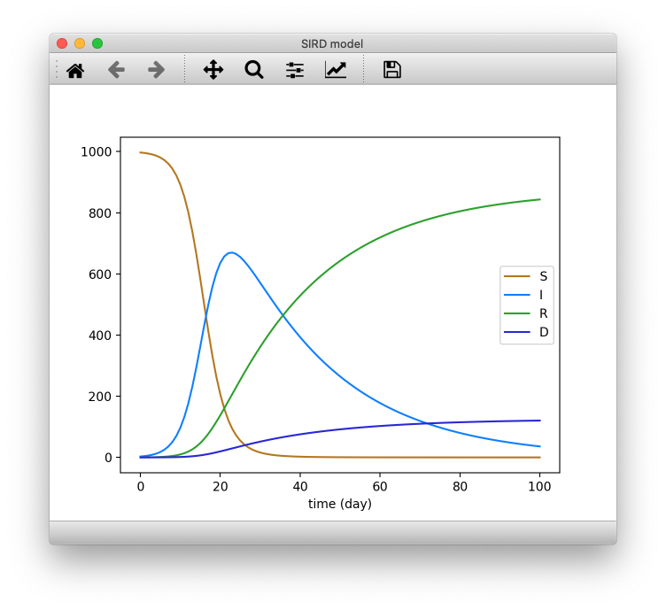

SEIR
====

An `OpenCOR <https://opencor.ws/>`_-based Python script to model Covid-19 using the `SEIR model <https://cpb-ap-se2.wpmucdn.com/blogs.auckland.ac.nz/dist/d/75/files/2017/01/Covid19_SEIR_model.pdf>`_.

Install/upgrade
---------------

From OpenCOR's ``Python Console`` window::

 !pip install -U git+https://github.com/ABI-Covid-19/seir.git

Uninstall
---------

From OpenCOR's ``Python Console`` window::

 !pip uninstall -y seir

Use
---

From OpenCOR's ``Python Console`` window::

 # Import the SEIR module.
 import seir

 # Create an instance of the SEIR model.
 m = seir.Model()

 # Run the model for 300 (default) and plot its results.
 m.run()
 m.plot()

 # Re-run the model for 150 days and plot its results.
 m.reset()
 m.run(150)
 m.plot()

 # Output the kind, name and values of the model's time parameter.
 t = m.parameters['time']
 print(' [', t.kind(), '] ', t.name(), ': ', t.values(), sep='')

 # Output the kind, name and values of all the model's parameters.
 for p in m.parameters.values():
     print(' [', p.kind(), '] ', p.name(), ': ', p.values(), sep='')

For the first run, you should get something like:

